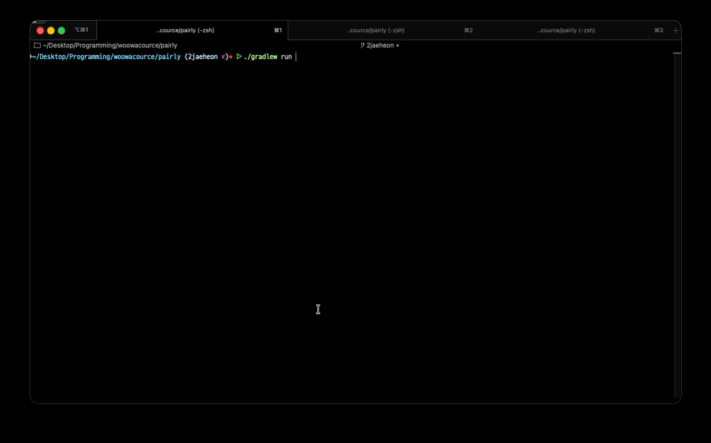

# 개요

이 애플리케이션은 Java와 소켓 통신을 이용해, 콘솔 환경에서 2명의 사용자가 실시간으로 페어 프로그래밍을 진행할 수 있도록 도와주는 애플리케이션입니다.

# 시연 영상

# 배경

기존의 페어프로그래밍은 같은 오프라인 공간에서 이루어집니다. 또한 프리코스 과정을 거치며 사람들과의 코드리뷰가 필요하고 중요하다는 것을 깨달았습니다.

하지만, 코드를 작성한 이후에 리뷰를 받는 것은 리뷰어가 코드를 이해하는 데에 시간이 걸리고, 작성자와 리뷰어 간의 피드백이 즉각적으로 이루어지지 않는다는 단점이 있습니다.
또한, 코드 작성자가 어떠한 의도로 코드를 작성했는지 리뷰어가 알기 어려운 경우가 많았습니다.

따라서 실시간으로 코드 작성자와 리뷰어가 상호작용할 수 있는 환경이 있다면 더 좋지 않을까 하는 생각에 이 프로젝트를 시작하게 되었습니다.

# 기능 명세

### 1. 세션과 역할 관리

- 시스템은 **서버–클라이언트 구조**로 동작한다.
- 서버는 클라이언트 연결을 관리하고, **두 명의 클라이언트가 접속하면 하나의 페어 프로그래밍 세션**을 시작한다.
- 세션에는 항상 2명이 참여하며, 각 사용자는 다음 두 역할 중 하나를 가진다.
    - **코드 작성자 (CodeWriter)**
    - **코드 리뷰어 (CodeReviewer)**
- 세션은 **5분 단위의 뽀모도로 방식**으로 진행되며, 주기가 끝날 때마다 두 사용자의 역할이 자동으로 서로 교대된다.
- 서버는 세션 타이머를 관리해야 하며, 타이머가 만료되면:
    - 남은 시간을 초기화하고
    - 두 사용자의 역할을 교대시킨다.

### 2. 코드 편집 및 동기화 (`:sync`)

- 코드 작성자는 자신의 로컬 IDE에서 자유롭게 코드를 편집할 수 있다.
- 코드 작성자는 `:sync [파일경로]` 명령어를 통해,
    - 지정된 파일의 **현재 코드 전체 내용을 서버와 동기화**한다.
- 서버는 전달받은 코드를 세션의 코드 상태로 저장하고, **두 사용자의 화면에 동일한 코드 내용을 전파**한다.
- 코드 작성자(Writer)는 코드 작성 역할 수행 중에 `:m` 명령어를 사용할 수 없다.

### 3. 실시간 코드 리뷰 (`:m`)

- 코드 리뷰어는 서버로부터 동기화된 코드를 콘솔 화면에서 확인할 수 있다.
- 모든 명령어는 `:` 문자로 시작한다.
- 코드 리뷰어는 `:m [라인번호] "[코멘트]"` 명령어를 통해,
    - 특정 라인에 대한 리뷰 코멘트를 남길 수 있다.
- 서버는 해당 라인에 리뷰 정보를 반영하고, **두 사용자의 화면에 리뷰 마킹이 함께 표시되도록** 동기화한다.
- 코드 리뷰어(Reviewer)는 리뷰 역할 수행 중에 `:sync` 명령어를 사용할 수 없다.

# 아키텍처

전체 시스템 아키텍처는 다음과 같습니다.

핵심 기능에 대한 다이어그램은 다음과 같습니다

# 설계 및 주요 객체

- **SessionManager**
    - 서버 측 단일 진입점으로, 두 클라이언트 세션과 역할, 에디터 상태, 뽀모도로 타이머를 관리합니다.
    - `synchronized` 메서드로 메시지 처리, 연결/해제, 역할 교대가 한 번에 하나씩만 수행되도록 동기화합니다.

- **ClientSession**
    - 각 클라이언트 소켓과 1:1로 매핑되는 세션 객체입니다.
    - 별도 스레드에서 소켓 입력을 읽고, 서버로부터의 출력(`sendMessage`)은 `synchronized`로 직렬화합니다.

- **PomodoroTimer**
    - `ScheduledExecutorService` 기반의 단일 스레드 타이머입니다.
    - 1초마다 남은 시간을 브로드캐스트하고, 만료 시 역할 교대 콜백을 호출합니다. 카운트다운은 `AtomicInteger`로 관리합니다.

- **ClientState / EditorState**
    - 클라이언트의 역할, 남은 시간, 코드/마커 상태를 나타내는 도메인 모델입니다.
    - 불변 객체 + `AtomicReference`로 관리하여, 입력/출력 스레드가 같은 상태를 안전하게 공유할 수 있도록 설계했습니다.

# 실행 방법

### 사전 준비

- Java 21 환경에서 구축되었으므로, java 21 이상을 권장합니다.
- 혼자서 테스트를 위해서는 터미널 세 개를 이용해서 서버 1개, 클라이언트 2개를 동시에 실행 가능해야 합니다.
- 서버와 클라이언트는 기본적으로 127.0.0.1:12345 로 통신하도록 설정되어 있습니다.
- 다른 네트워크에서 하기 위해서는 IP를 변경해주시면 됩니다.

### 서버 실행

프로젝트 루트 디렉토리에서 다음 명령어를 실행하면 됩니다. 
`./gradlew run`

### 클라이언트 실행

다음 명령어를 실행합니다. 
`./gradlew runClient --console=plain`

### 주요 명령어

클라이언트 콘솔에서 다음 명령어들을 입력할 수 있습니다.

- `:sync [파일경로]`
    - 코드 작성자(Writer)가 사용
    - 주어진 파일의 전체 내용을 서버와 동기화하고, 두 사용자의 화면에 반영합니다.
    - 파일의 경로는 절대 경로입니다.

- `:m [라인번호] "[코멘트]"`
    - 코드 리뷰어(Reviewer)가 사용
    - 특정 라인에 리뷰 코멘트를 남기고, 두 사용자의 화면에 마크를 표시합니다.

- `:quit`
    - 세션에서 나가고 클라이언트를 종료합니다.

# 사용 예시 플로우 (하나의 pc에서 테스트)

1. **서버 실행**
    - 터미널 1에서 프로젝트 루트로 이동 후 다음 명령어를 실행합니다.
    - `./gradlew run`

2. **클라이언트 1 (코드 작성자) 실행**
    - 터미널 2에서 다음 명령어를 실행합니다.
    - `./gradlew runClient --console=plain`
    - 서버에 연결되면, 콘솔 하단에 프롬프트(`> `)가 보입니다.
    - IDE에서 작업 중인 파일 경로를 복사한 뒤, 아래와 같이 입력합니다.
        - `:sync /absolute/path/to/YourCode.java`

3. **클라이언트 2 (코드 리뷰어) 실행**
    - 터미널 3에서 동일한 명령어를 실행합니다.
    - `./gradlew runClient --console=plain`
    - 서버에 두 명이 모두 접속되면, 자동으로 세션이 시작되고 두 클라이언트 화면에 동일한 코드가 표시됩니다.

4. **리뷰 남기기**
    - 클라이언트 2(리뷰어)는 화면을 보면서 특정 라인에 대해 다음과 같이 코멘트를 남길 수 있습니다.
        - `:m 10 "여기 변수 이름이 조금 헷갈려요"`
    - 두 클라이언트 모두 해당 라인 오른쪽에 리뷰 코멘트가 표시됩니다.

5. **역할 교대**
    - 약 5분(한 뽀모도로)이 지나면, 서버 타이머가 만료되고 두 사람의 역할이 자동으로 교대됩니다.
    - 헤더의 역할 표시가 바뀌며, 기존 리뷰어가 `:sync`를 사용할 수 있게 되고, 기존 작성자는 `:m`을 사용할 수 있게 됩니다.

6. **세션 종료**
    - 어느 클라이언트에서든 다음 명령어를 입력하면 세션에서 나가며 클라이언트가 종료됩니다.
    - `:quit`