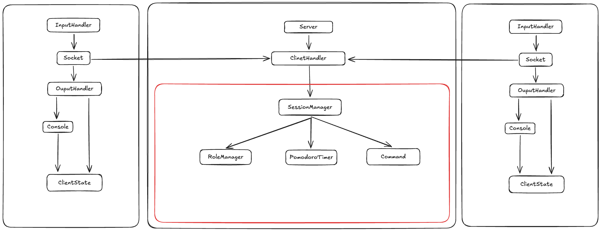

# 개요

이 애플리케이션은 Java와 소켓 통신을 이용해, 콘솔 환경에서 2명의 사용자가 실시간으로 페어 프로그래밍을 진행할 수 있도록 도와주는 애플리케이션입니다.

# 배경

기존의 페어프로그래밍은 같은 오프라인 공간에서 이루어집니다. 또한 프리코스 과정을 거치며 사람들과의 코드리뷰가 필요하고 중요하다는 것을 깨달았습니다.

하지만, 코드를 작성한 이후에 리뷰를 받는 것은 리뷰어가 코드를 이해하는 데에 시간이 걸리고, 작성자와 리뷰어 간의 피드백이 즉각적으로 이루어지지 않는다는 단점이 있습니다.
또한, 코드 작성자가 어떠한 의도로 코드를 작성했는지 리뷰어가 알기 어려운 경우가 많았습니다.

따라서 실시간으로 코드 작성자와 리뷰어가 상호작용할 수 있는 환경이 있다면 더 좋지 않을까 하는 생각에 이 프로젝트를 시작하게 되었습니다.

# 기능 명세

### 1. 세션과 역할 관리

- 시스템은 **서버–클라이언트 구조**로 동작한다.
- 서버는 클라이언트 연결을 관리하고, **두 명의 클라이언트가 접속하면 하나의 페어 프로그래밍 세션**을 시작한다.
- 세션에는 항상 2명이 참여하며, 각 사용자는 다음 두 역할 중 하나를 가진다.
    - **코드 작성자 (CodeWriter)**
    - **코드 리뷰어 (CodeReviewer)**
- 세션은 **5분 단위의 뽀모도로 방식**으로 진행되며, 주기가 끝날 때마다 두 사용자의 역할이 자동으로 서로 교대된다.
- 서버는 세션 타이머를 관리해야 하며, 타이머가 만료되면:
    - 남은 시간을 초기화하고
    - 두 사용자의 역할을 교대시킨다.

### 2. 코드 편집 및 동기화 (`:sync`)

- 코드 작성자는 자신의 로컬 IDE에서 자유롭게 코드를 편집할 수 있다.
- 코드 작성자는 `:sync [파일경로]` 명령어를 통해,
    - 지정된 파일의 **현재 코드 전체 내용을 서버와 동기화**한다.
- 서버는 전달받은 코드를 세션의 코드 상태로 저장하고, **두 사용자의 화면에 동일한 코드 내용을 전파**한다.
- 코드 작성자(Writer)는 코드 작성 역할 수행 중에 `:m` 명령어를 사용할 수 없다.

### 3. 실시간 코드 리뷰 (`:m`)

- 코드 리뷰어는 서버로부터 동기화된 코드를 콘솔 화면에서 확인할 수 있다.
- 모든 명령어는 `:` 문자로 시작한다.
- 코드 리뷰어는 `:m [라인번호] "[코멘트]"` 명령어를 통해,
    - 특정 라인에 대한 리뷰 코멘트를 남길 수 있다.
- 서버는 해당 라인에 리뷰 정보를 반영하고, **두 사용자의 화면에 리뷰 마킹이 함께 표시되도록** 동기화한다.
- 코드 리뷰어(Reviewer)는 리뷰 역할 수행 중에 `:sync` 명령어를 사용할 수 없다.

# 아키텍처

전체 시스템 아키텍처는 다음과 같습니다.

핵심 기능에 대한 다이어그램은 다음과 같습니다

